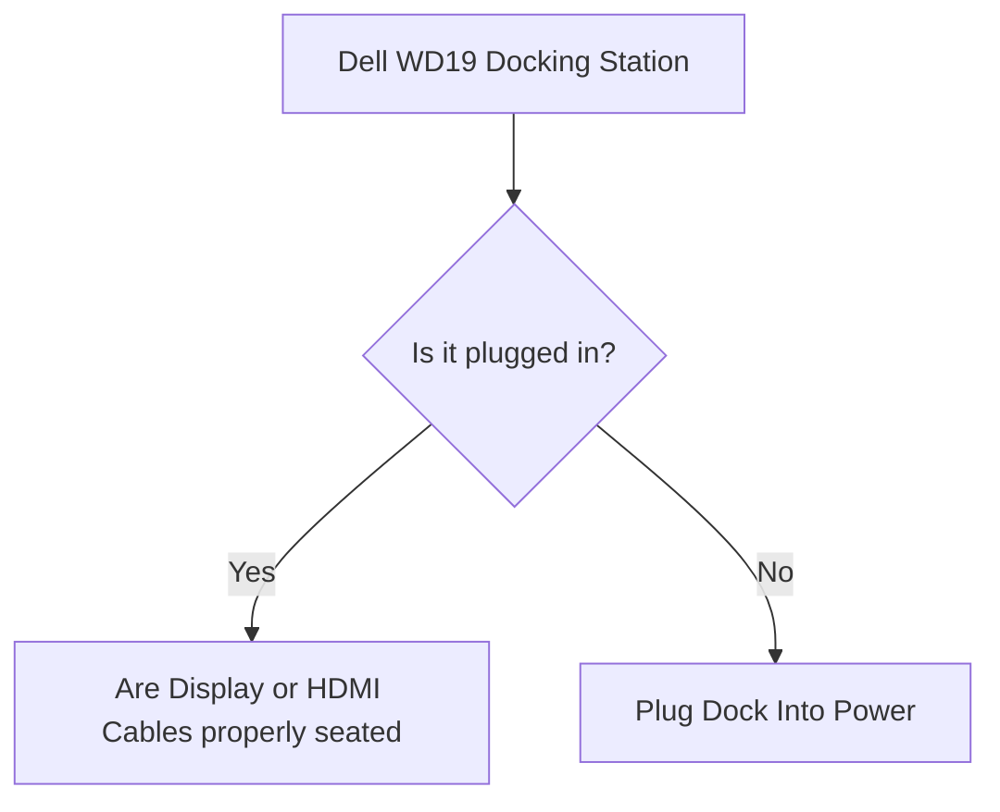

Test

[[Note in Folder test]]

```mermaid  
flowchart TD  
A[Dell WD19 Docking Station] --> B{Is it plugged in?}  
B -->|Yes| C[Are Display or HDMI Cables properly seated]  
B -->|No| D[Plug Dock Into Power]
```

flowchart TD
A[Dell WD19 Docking Station]
A --> B{Is it plugged in?}
B -->|Yes| C[Check Display Output]
B -->|No| D[Plug Dock Into Power]

